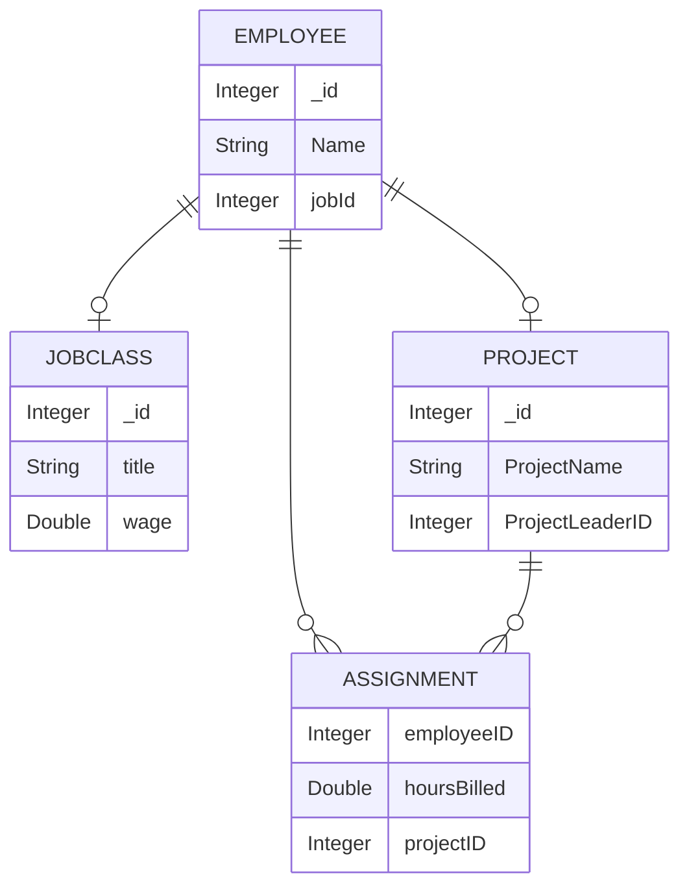

# API Design and Databases Projects

This repository contains projects to hone my RESTful API and database schema creation skills with MVC architecture

Utilizes: NoSQL, Redis, Java Swing, Jedis (Java client library for Redis)


**Projects**:
- Project 2 - Facebook Marketplace
- Project Management Restful API

# Project 2 - Facebook Marketplace 

A Java-based Facebook Marketplace simulation utilizing a MVC architecture, Redis database for fast data storage and retrieval, and a Java Swing frontend.

**Demo**: [Youtube Link](https://www.youtube.com/watch?v=xNmXPM6hOgM&ab_channel=Alchemsitx)


## Features
### Profile Management
- Retrieves user-specific information.
-  Users can update personal details, including credit card information.

### Marketplace Functionality
- Buy & Sell Items: Users can list items for sale and purchase available products.
- Manage Listings:
  - Add, edit, and remove items for sale.
  - Modify details of items held for purchase.
- Search & Filtering:
  - Exposes a GET endpoint to retrieve products within a specified price range.
  - URL format:
    - `<baseurl>/products/search?minprice=<min_price>&maxprice=<max_price>`

## Database Schemas
#### Users:
-	Represents any user who wants to login and buy or sell anything
-	They have a credit card number associated with them
-	Stored in Redis as follows:
``` js
users:[“username”] {
  creditCard: String
}
```

#### Products:
-	List of items that users are either buying or selling
-	Has price, quantity, and a user associated with it
-	The user represents who is selling the item.
-	Stored in Redis as follows:
``` js
Products:[“productName”] {
  price: Double stored as String
  quantity: Integer stored as String
  seller: username (reference to user:___ table)
}
```

### Visuals


 


# Project Management Restful API
A NoSQL-based project management system built with Java and Java Swing, featuring a RESTful API for seamless CRUD operations and resource management.

## Key Features
### Job Management
- Create, edit, and delete job roles within the system.

### Employee Management
- Add, update, and remove employees.
- Assign employees to specific jobs.

### Project Management
- Create, modify, and delete projects.
- Assign an employee as a Project Manager during project creation.
- Allocate employees to projects and track their billable hours.
- Automatically calculate and update employee earnings based on billable hours.

## Database Schema

#### Employee
```js
{
  "_id": Integer,
  "Name": String,
  "jobId": Integer
}
```

#### JobClass
```js
{
  "_id": Integer,
  "title": String,
  "wage": Double
}
```

#### Project
```js
{
  "_id": Integer,
  "ProjectName": String,
  "ProjectLeaderID": Integer,
  "Assignments": [
    {
      "employeeID": Integer,
      "hoursBilled": Double
    }
  ]
}
```


